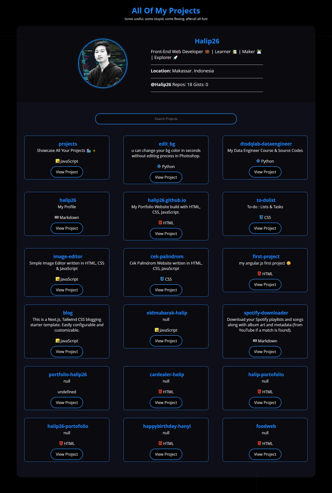

<div align = "center">

<h1><a href="https://halip26.github.io/projects">Projects</a></h1>

<a href="https://github.com/Halip26/projects/blob/main/LICENSE">
 </a>

<a href="https://github.com/Halip26/projects/graphs/contributors">
 </a>

<a href="https://github.com/Halip26/projects/stargazers">
</a>

<a href="https://github.com/Halip26/projects/network/members">
 </a>

<a href="https://github.com/Halip26/projects/watchers">
 </a>

<a href="https://github.com/Halip26/projects/pulse">
 </a>

<h3>Showcase All Your Projects 🛍️🎇</h3>

<figure>
  
  <br/>
  <figcaption>projects screenshot</figcaption>
</figure>

</div>

## Introducing Projects

Present all your projects in style with a super customizable web app! ✨

`Projects` uses the GitHub API to list all your GitHub projects in a nice searchable grid.
Also shows pretty programming icons using `devicons`.

## Inspiration

Needed a way to display all my projects, used my [portfolio's project section](https://2kabhishek.github.io/#projects) as inspiration.

## Getting Projects

To get projects, follow these steps:

```bash
git clone https://github.com/Halip26/projects.git
cd projects
```

### Setup Your Own Projects

You can set up projects for yourself by following these steps:

- Fork the repo: https://github.com/2kabhishek/projects
- Clone it locally / Open it in GitHub Codespaces
- Open up `script.js` and update the `username` variable to your GitHub username.
- Open up `index.html` and update the `title` tag to make it your own.
- You may also want to update the favicon by updating the `link` tag in `index.html`
- Commit and push your changes
- Go to repo settings on GitHub, under `Pages` enable GitHub Pages.
  - Choose 'Deploy from a branch' with the `main` branch and `/` as the root directory.
- Done!

The site should be live on `https://<your-username>.github.io/projects`

#### Number Of Repos

The number of repos shown changes with the `maxPages` variable, the GitHub API supports 100 repos per page max.
If you have less than 100 repos, set `maxPages` to 1, if you have 300 then 3.

You can also edit the fetch query to reduce the per page repo count.

> There's no pagination, all repos show up on the same page.

### Forked Repos

To show forked repos set `hideForks = false` in `script.js`

### Authenticated Requests

If you are working locally and notice the API is not sending over data, it might be because of rate limit on GitHub API requests.

You can either wait for an hour or setup a personal access token on GitHub and pass that into the fetch request in `script.js`

### Themes

Comes with a dark and light theme by default, depends upon your system and browser settings.

Edit the variables under `:root` in `styles.css` to change color scheme.

### Programming Language Icons

Open `index.html` in your favorite browser or visit [2kabhishek.github.io/projects](https://2kabhishek.github.io/projects).

## How it was built

I built `Projects` using `HTML` `CSS` `JavaScript` and Neovim

## What I learned

- Learned about some quirks of the fetch API, during implementation of `maxPages`.
- Revisited Flex, box-shadow and some other CSS tricks

## What's next

You tell me!

Hit the ⭐ button if you found this useful.

## More Info

<div align="center">

<a href="https://github.com/Halip26/projects">Source</a> | <a href="https://halip26.github.io/projects">Website</a>

</div>
